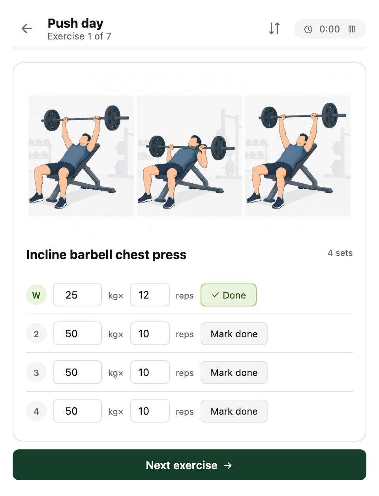
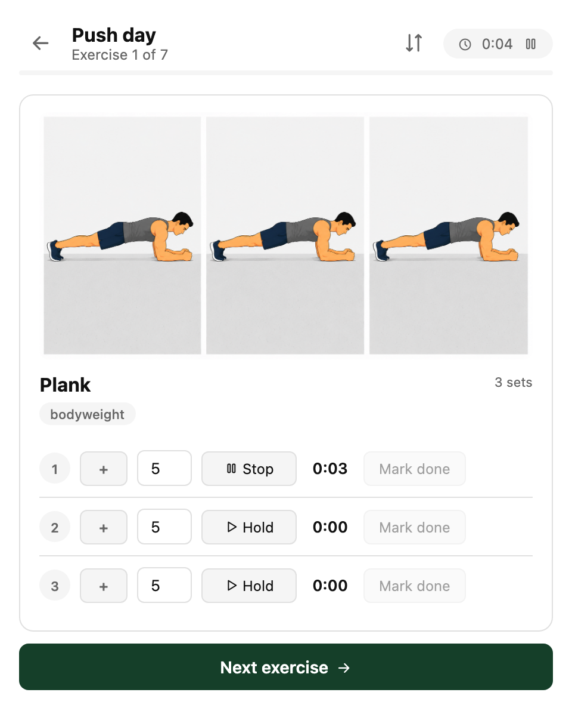
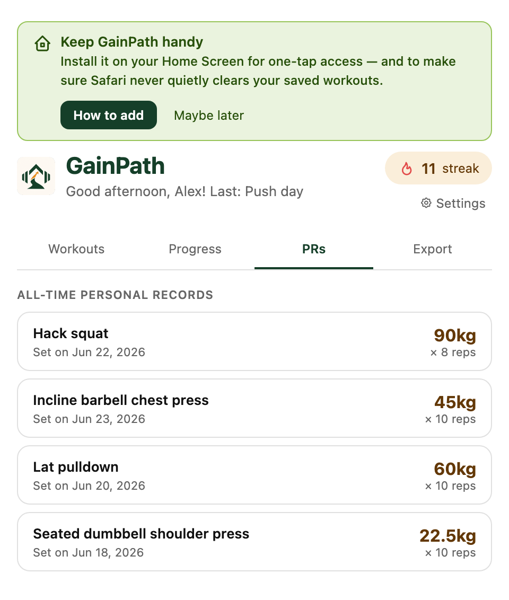

# GainPath — AI Workout Tracker

A free, open-source AI-powered workout tracking web app. No account needed, no subscriptions, no ads. Just open it and train.

🔗 **Live app:** [jedmangubat.github.io/gainpath](https://jedmangubat.github.io/gainpath)

GainPath is free, ad-free, and has no subscriptions. If it's been useful to you, consider [☕ supporting development via PayPal](https://www.paypal.com/donate/?business=jed.mangubat@me.com).

---

## Screenshots

<table>
<tr>
<td align="center" width="33%"> Home — day picker, streak, suggested day, recent sessions</td>
<td align="center" width="33%"> Reorder, swap, or delete exercises — before or during a workout</td>
<td align="center" width="33%"> Logging sets — weight, reps, rest timer</td>
</tr>
<tr>
<td align="center" width="33%"> Bodyweight added/assisted weight + plank hold timer</td>
<td align="center" width="33%"> Weight progression chart per exercise</td>
<td align="center" width="33%"> All-time personal records</td>
</tr>
</table>

---

## Features

### 🏋️ Training splits
Five split types to choose from — see "What each day hits" further down for the muscle groups each one targets:
- **PPL / Upper-Lower** — Push, Pull, Legs, Upper, Lower (5-day)
- **5-Day Bro Split** — Legs, Chest, Back, Shoulders, Arms (one muscle group per day)
- **Alternating Legs/Push/Pull** — Legs A, Push, Legs B, Pull (rotating 4-day)
- **Upper / Lower** — Upper, Lower A (Legs), Lower B (rotating)
- **Full Body** — full-body session hitting every major muscle group

### 🔀 Full control over each day's exercises
Picking a day no longer locks you into a fixed exercise list — tap a day to open its editor first:
- **Reorder** by dragging, **delete**, or **swap** an exercise (pick a body part, then a replacement from that part's pool) — by dragging the handle, tapping the swap/trash icons, or swiping a row (right to swap, left to delete)
- Your changes become that day's new default automatically, so you don't have to redo them every time
- Tap into an exercise to set its planned sets, reps, and weight before you start
- Bodyweight exercises (push-ups, pull-ups, dips, plank) support an optional added weight (vest/belt) or assisted weight (band/machine) modifier instead of a flat "BW" label
- Plank gets its own hold-duration stopwatch in place of a reps counter, with PRs tracked for longer holds
- Everything above is also available **mid-workout**, scoped to whatever's left in the session (plus the exercise you're currently on, if you haven't done its first set yet), via the reorder icon on the workout screen
- Confirms before advancing past an exercise with sets still left undone, in case "Next exercise" or "Finish workout" gets tapped by mistake

### 📋 Smart onboarding
- Name, sex (male/female), body weight, height, body fat %
- Strength baseline — recent weights on key lifts (hack squat, chest press, lat pulldown, overhead press)
- Experience level and fitness goal
- Training frequency → app suggests the right split
- Preferred reps, sets, rest time, warm-up set preferences
- Starting weight method — AI estimate or manual entry

### ⚖️ Smart weight system
- AI estimates starting weights from your body stats, experience level, and strength baseline
- Machine tare weight system — enter the base weight of plate-loaded machines once, saved permanently. The app shows plate weight only and calculates total automatically
- Warm-up sets on the first exercise per muscle group only, at 50% of working weight

### ⏱️ Rest timer
- Automatic rest timer after each set, adjustable with +15s / -15s buttons
- Color changes: orange at 30s, red at 10s; shorter timer for warm-up sets
- A random tip on the exercise you're resting from, picked from curated form/efficiency/safety cues for every exercise in the database — the last rest before a new exercise tips you on what's coming up instead
- Per-exercise RPE rating after each exercise (Too easy / Just right / Hard / Too much), plus an overall session feel rating before the summary screen

### 🤖 AI coaching (optional, bring your own API key)
- Add your own Anthropic API key in Settings to enable real Claude-powered coaching on top of the built-in tips and weight math, which work either way
- The rest-screen tip gets upgraded in place with a personalized set assessment once Claude responds
- Your RPE rating gets a one-line next-session weight suggestion
- The summary screen gets a "Next-session recommendations" note per exercise
- The key is stored only in your browser, never in exported backups — Anthropic bills usage directly to your key, GainPath itself stays free

### 📈 Progress tracking
- Progress charts — max weight per exercise over time
- Personal record (PR) tracker — auto-detects new PRs, celebrates on screen
- Streak counter — consecutive training days
- Session history

### 📄 Monthly PDF report
- Color-coded training calendar
- Session stats (total sessions, sets, new PRs, streak)
- Bar chart of sessions by day type
- Strength gains table
- New personal records list

### 💾 Data backup
- Export all your data as a JSON file
- Restore from backup on any device
- No cloud account needed

### 💬 Feedback
- Built-in feedback form for bug reports, feature requests, and general feedback

---

## How to use

1. Open the app at [jedmangubat.github.io/gainpath](https://jedmangubat.github.io/gainpath)
2. Complete the one-time setup (takes about 2 minutes)
3. Pick your training day and start logging sets
4. Rate how each exercise felt — it's saved with your session, and next time defaults to the weight you last logged
5. On iPhone: tap Share → **Add to Home Screen** for a native app experience

---

## What each day hits

Exercises are no longer fixed per day — every list below is just the
**starting default**. Open any day from the home screen to reorder, swap, or
delete exercises before you start (see "Full control over each day's
exercises" above); your changes become the new default for that day going
forward. What *doesn't* change is which muscle groups a given day is built
around:

### PPL / Upper-Lower
| Day | Muscles hit |
|---|---|
| Push | Chest, Shoulders, Triceps |
| Pull | Back, Rear delts, Biceps (Traps too, on the female default pool) |
| Legs | Quads, Hamstrings, Adductors, Calves, Core |
| Upper | Chest, Back, Shoulders, Rear delts, Biceps, Triceps |
| Lower | Quads, Hamstrings, Abductors, Core |

### 5-Day Bro Split
| Day | Muscles hit |
|---|---|
| Legs | Quads, Hamstrings, Calves, Core |
| Chest | Chest |
| Back | Back |
| Shoulders | Shoulders, Rear delts |
| Arms | Biceps, Triceps |

### Alternating Legs/Push/Pull
| Rotation | Muscles hit |
|---|---|
| Day 1 — Legs A | Same as PPL Legs day |
| Day 2 — Push | Same as PPL Push day |
| Day 3 — Legs B | Same as PPL Lower day |
| Day 4 — Pull | Same as PPL Pull day |

### Upper / Lower
| Day | Muscles hit |
|---|---|
| Upper | Chest, Back, Shoulders, Rear delts, Biceps, Triceps |
| Lower A | Same as PPL Legs day |
| Lower B | Same as PPL Lower day |

### Full Body
Chest, Back, Shoulders, Biceps, Triceps, Quads, Hamstrings, Calves, Core — one exercise per group, every session.

Male and female onboarding pick from slightly different default exercises for
the same muscle groups (e.g. machine vs. dumbbell variants) — swap freely
either way, the substitution pool isn't gendered.

---

## Add to iPhone home screen

1. Open [jedmangubat.github.io/gainpath](https://jedmangubat.github.io/gainpath) in Safari
2. Tap the **Share** button (box with arrow)
3. Tap **Add to Home Screen**
4. Tap **Add**

The app will appear on your home screen and open full-screen like a native app. Your workout data is saved in Safari's local storage.

> **Tip:** Export a backup regularly from the Export tab to protect your data.

---

## Tech stack

- Single HTML file — no framework, no build step, no backend
- Optional AI coaching via [Claude](https://anthropic.com) (claude-sonnet-4-6), called directly from the browser with your own API key — no proxy server needed
- Charts via [Chart.js](https://chartjs.org)
- PDF export via [jsPDF](https://parall.ax/products/jspdf)
- Feedback via [EmailJS](https://emailjs.com)
- Data stored in browser localStorage

---

## Contributing

Found a bug or have a feature idea? Use the feedback form inside the app (Settings → Send feedback) or open an issue on this repo.

---

## License

MIT — free to use, modify, and share.
