# GainPath — Workout Tracker

A free, open-source workout tracking web app. No account needed, no subscriptions, no ads. Just open it and train.

🔗 **Live app:** [jedmangubat.github.io/gainpath](https://jedmangubat.github.io/gainpath)

GainPath is free, ad-free, and has no subscriptions. If it's been useful to you, consider [☕ supporting development via PayPal](https://www.paypal.com/donate/?business=jed.mangubat@me.com).

---

## ✨ What's new in v1.10.0

- **New look: "Trail"** — a full visual redesign leaning into the GainPath mountain-path logo. Topographic contour lines in the background, a warm serif display type, rounder cards, and a Progress tab that visualizes your training as an elevation profile — every point that set a new best marked as a flag along the ascent. Replaces the previous "Ledger" paper-logbook theme.
- **Optional native-app launch notification** — in Settings → Native app updates, leave an email if you want to hear when the upcoming iOS/Android app ships. Completely optional; GainPath still needs no account to use.
- Added anonymous, aggregate-only usage analytics (random per-device ID, no accounts, no third-party trackers, no personal data) to help gauge whether this free trial is worth building a paid native app around — see `CHANGELOG.md` for details.
- Bug fixes and stability improvements — see `CHANGELOG.md` for details.

---

## Features

### 🏋️ Training splits

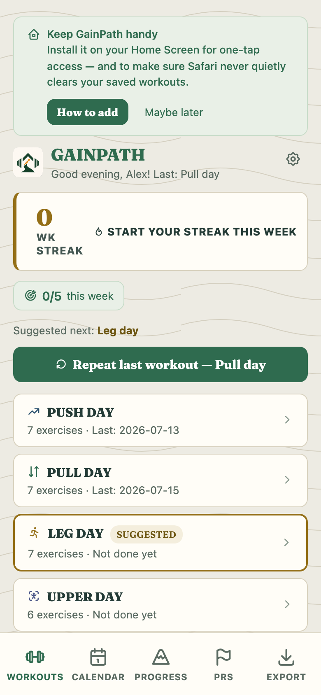

Five split types to choose from — see "What each day hits" further down for the muscle groups each one targets:
- **PPL / Upper-Lower** — Push, Pull, Legs, Upper, Lower (5-day)
- **5-Day Bro Split** — Legs, Chest, Back, Shoulders, Arms (one muscle group per day)
- **Alternating Legs/Push/Pull** — Legs A, Push, Legs B, Pull (rotating 4-day)
- **Upper / Lower** — Upper, Lower A (Legs), Lower B (rotating)
- **Full Body** — full-body session hitting every major muscle group

### 🔀 Full control over each day's exercises

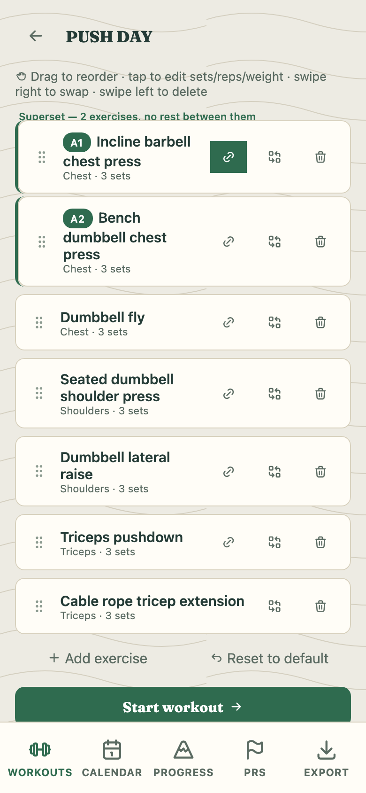

Picking a day no longer locks you into a fixed exercise list — tap a day to open its editor first:
- **Reorder** by dragging, **delete**, **swap**, or **add** an exercise (pick a body part, then a pick from that part's pool, ordered barbell → dumbbell → machine → cable → bodyweight with an equipment label on each row) — by dragging the handle, tapping the swap/trash/add icons, or swiping a row (right to swap, left to delete)
- Your changes become that day's new default automatically, so you don't have to redo them every time
- Tap into an exercise to set its planned sets, reps, and weight before you start
- Bodyweight exercises (push-ups, pull-ups, dips, plank) support an optional added weight (vest/belt) or assisted weight (band/machine) modifier instead of a flat "BW" label
- Plank gets its own hold-duration stopwatch in place of a reps counter, with PRs tracked for longer holds
- Everything above is also available **mid-workout**, scoped to whatever's left in the session (plus the exercise you're currently on, if you haven't done its first set yet), via the reorder icon on the workout screen
- Confirms before advancing past an exercise with sets still left undone, in case "Next exercise" or "Finish workout" gets tapped by mistake
- **Supersets & circuits** — link an exercise with the next one in the editor to pair them (2 linked = superset, 3+ = circuit). During the workout you alternate one set of each back-to-back with no rest, resting once per round. Each exercise still tracks its own feel rating, volume, and PRs
- **Drop sets** — a "+ Drop" button on any set marks it done and adds a lighter set (70% of the weight) so you can push past failure; it counts toward volume and PRs like any work set
- **Custom exercises** — for a machine or movement not in the built-in database, add your own (name, muscle group, equipment) from the swap/add-exercise picker. No bundled photo is required — the exercise card falls back to a YouTube search link instead. Fully deletable, and everything (PRs, charts, history, suggestions, export/import) picks it up automatically

### 🧱 Build your own program

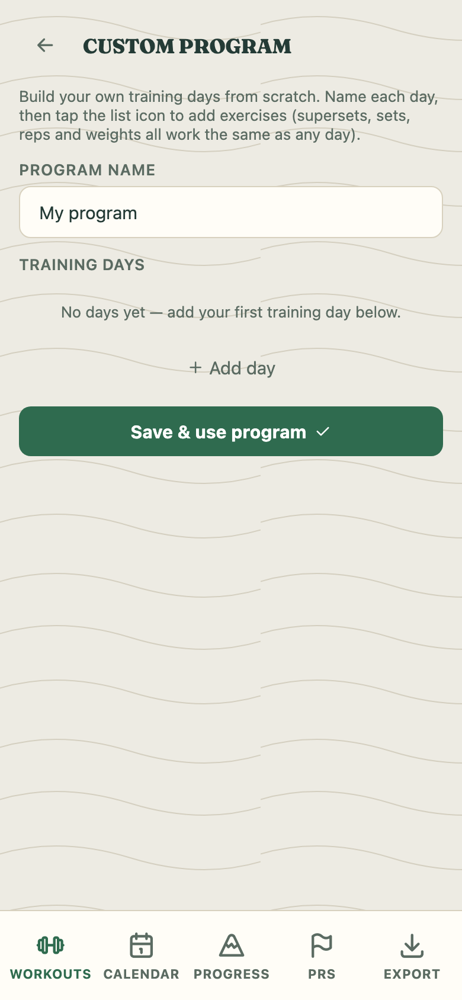

Not limited to the five built-in splits — tap "Build a custom program" on the home screen to create your own: name it, add and name training days, and set each day's exercises with the full editor (supersets, planned sets/reps/weight and all). Activating it makes the home screen show your custom days; it's editable and deletable later (deleting keeps your logged history), and selectable in Settings next to the built-in splits.

### 📋 Smart onboarding

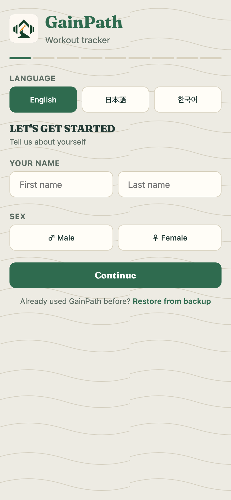

- Language (English / 日本語 / 한국어), first and last name, sex (male/female), body weight, height, body fat %
- Strength baseline — recent weights on key lifts (hack squat, chest press, lat pulldown, overhead press)
- Experience level and fitness goal
- Training frequency → app suggests the right split (beginners are pointed to the one-muscle-group-per-day Bro Split — the simplest to learn)
- Preferred reps, sets, rest time, warm-up set preferences
- Starting weight method — estimate from your stats, or manual entry

### ⚙️ Organized Settings

A language picker (English / 日本語 / 한국어) sits at the top, then a menu of seven sections — Profile, Preferences, My gym, Machine base weights, Planned rest, Apple Watch sync, Native app updates — each opening its own screen and saving automatically when you back out, instead of one long scrolling page. Workouts, Calendar, Progress, PRs, and Export are always-visible bottom tabs, so navigation never disappears while you're deep in a day's exercises or a Settings screen.

### ⚖️ Smart weight system

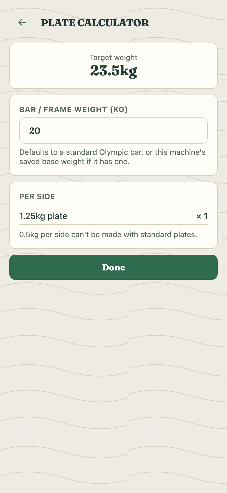

- Estimates starting weights from your body stats, experience level, and strength baseline
- Suggests your next weight from how the exercise felt last time — rate it "Too easy" and the app offers a small bump, rate it "Too much" and it offers to back off. Always a one-tap suggestion you can apply or dismiss, never an automatic change
- Change a set's rep count mid-workout and the next session pre-fills that exercise with the same rep target, the same way weights already carry over
- Machine tare weight system — enter the base weight of plate-loaded machines once, saved permanently. The app shows plate weight only and calculates total automatically
- **Plate calculator** — tap the plate icon by any weight to see the per-side breakdown ("20 + 10 + 2.5 per side"), accounting for the bar/machine base weight and your kg/lb plate set
- **Your own gym, modeled exactly** — a "My gym" section in Settings where you tap the plates and dumbbells you actually have (not how many of each, just which ones — real gyms rarely run out of a plate size). The plate calculator and weight suggestions then only ever propose combinations you can really load, snapping a suggested dumbbell weight to the nearest one on your rack even if it steps unevenly (e.g. 1kg jumps up to 10kg, then 2.5kg jumps after)
- **Deload & overtraining advisor** — if your last three sessions all felt Hard or Too Much, or a tracked lift has stalled for three sessions running, a home banner offers to auto-load your next session's weights at −30%, one tap to apply or dismiss
- **±weight steppers** beside every weight input during logging — two taps instead of the keyboard for the vast majority of adjustments
- Warm-up sets on the first exercise per muscle group — pick 1, 2, or 3 ramping sets (e.g. 40/60/80% of your working weight) in Settings
- **Straight or pyramid sets** — choose same-weight-across-sets, or a pyramid where reps step down as weight goes up (12/10/8). Either way, change the first set's weight and the rest are calculated for you

### ⏱️ Rest timer

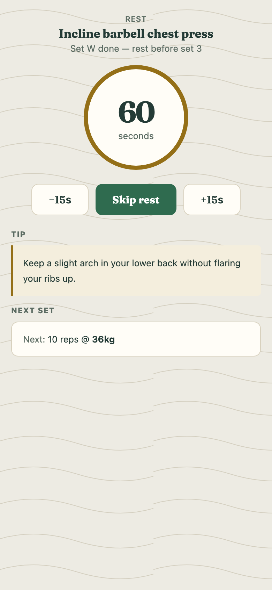

- Automatic rest timer after each set, adjustable with +15s / -15s buttons
- The ring turns red for the final 10 seconds; shorter timer for warm-up sets
- Tap the **`?` button** next to any exercise name during a workout to open a step-by-step instruction sheet — equipment setup, starting position, the full movement, and key form notes for that exercise

  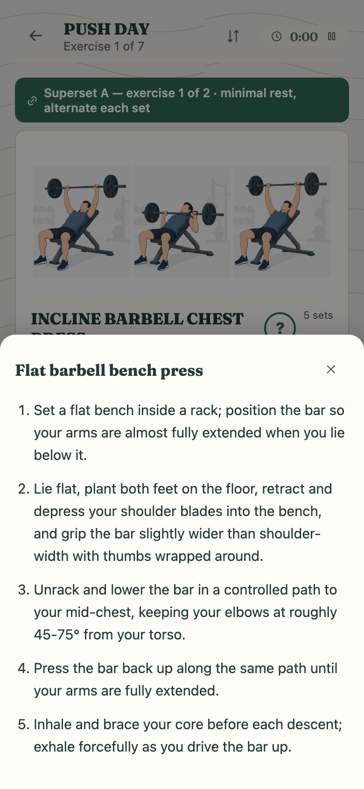
- A random form tip on the exercise you're resting from, picked from curated cues for every exercise in the database — also shown on the exercise card while you log, and the last rest before a new exercise tips you on what's coming up instead
- The rest after an exercise's last set previews the next exercise — its name plus the weight and reps of its first (or warm-up) set — so you can set up while you rest
- Optional sound & vibration you can't sleep through (toggle in Settings): the last 5 seconds beep and buzz every second, and zero fires a triple-beep alarm with a long vibration
- **Hold timer beeps** — timed holds (plank, dead hang, farmers carry…) beep through the final 5 seconds and fire a stronger alert the moment you match or beat your last logged best, the same audible-feedback pattern as the rest timer
- **Keep the screen awake** during a workout (toggle in Settings) — no more Face ID between every set
- If you've switched to another app when the timer ends, GainPath sends a **notification** to pull you back (Android/desktop; iPhone PWAs can't run timers in the background, so there the alarm fires the instant you reopen the app)
- Per-exercise RPE rating after each exercise (Too easy / Just right / Hard / Too much) — you can tap it right on the last-set rest screen while the timer counts down, or on the dedicated screen after — plus an overall session feel rating before the summary screen

### 🎨 Design & dark mode

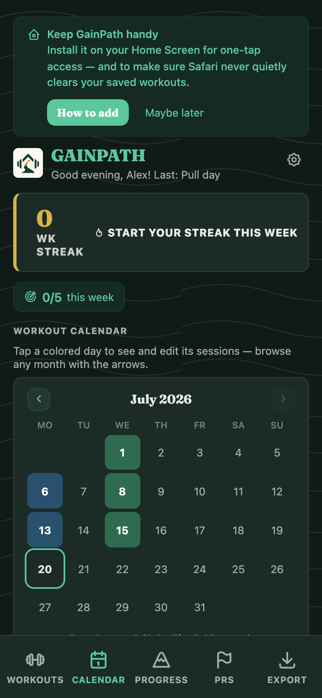

The **"Trail"** look, leaning into the GainPath mountain-path logo. The
light theme (the default) has a warm, fog-toned background with a subtle
topographic contour-line pattern, rounded cream cards, a serif display type
(Fraunces) on headers and numerals in place of the previous monospace
styling, and the same green-and-amber accent (matching the GainPath logo)
on primary buttons, the active tab, focus states, and charts. PRs still
stamp on in a rotated amber-gold style, and the Progress tab's chart reads
as an elevation profile — every point that set a new best marked with a
larger amber waypoint dot, like flags along an ascent. Motion follows the
same idea: quick screen transitions and a streak number that ticks up like
an odometer (`prefers-reduced-motion` respected throughout). Dark mode
flips it to a **summit night** — deep moss-navy background, the same
green-and-amber accent in brighter dark-mode tones — switchable in Settings
and remembered between sessions.

### 📈 Progress tracking

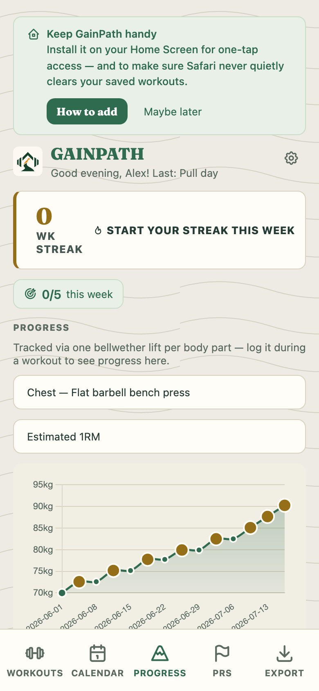

- Progress chart anchored to one bellwether lift per body part (chest → flat barbell bench press, back → barbell row, quads → barbell back squat, shoulders → barbell overhead press) — plot **estimated 1RM** (default), **max weight**, or **session volume** over time for that lift
- Per-exercise session history — pick any exercise to see every past date logged for it, with the sets you logged, that session's volume and best estimated 1RM, and how it felt
- **Notes that remember for you** — jot a note on any exercise mid-workout ("seat position 4", "left shoulder pinch") or on the whole session; next time you land on that exercise, GainPath reminds you what you wrote
- Personal record (PR) tracker — auto-detects new PRs, celebrates on screen, and shows each PR's estimated 1RM; tap any PR to see the full timeline of every time that record was broken, not just the current best
- **Weekly muscle-group volume balance** — hard sets per muscle group this week, sorted as horizontal bars, with a flag when a mirror-muscle pair (chest/back, quads/hamstrings, biceps/triceps) looks lopsided
- Total training volume (tonnage) on every session summary and in history
- **Body weight & measurements** — log weigh-ins (with optional waist/arms) and see your weight trend on a chart, right in the Progress tab
- **Workout calendar = session browser** — its own Calendar tab with training days color-coded by workout type; tap a colored day to list every session logged that day (duration, volume, sets, feel) and open any of them, browse past months with the arrows, and see monthly totals
- **A streak that survives real life** — mark a single day or a whole week as planned rest (sick, traveling, deloading) in Settings, and your weekly streak pauses instead of resetting to zero
- Streak counter — consecutive weeks hitting your training frequency, plus a weekly goal ("3/5 this week")
- **Repeat last workout** — one tap on the home screen re-runs your most recent day with weights and reps prefilled
- Tap into any past session from the calendar to **edit a mis-logged weight/reps or delete it**; PRs recalculate automatically
- **Shareable session card** — after "Session done!", share a designed summary card (day, duration, volume, PRs) via your phone's share sheet, or long-press to save it

### 📄 Monthly PDF report

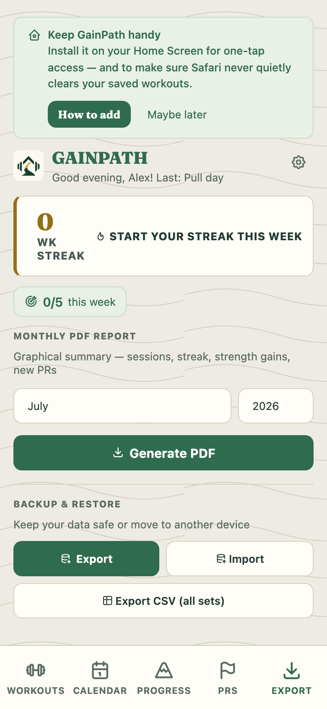

- Color-coded training calendar
- Session stats (total sessions, sets, new PRs, streak)
- Bar chart of sessions by day type
- Strength gains table
- New personal records list

### 💾 Data backup

- Export all your data as a JSON file, or as a flat **CSV** of every logged set (date, day, exercise, set, weight, reps, feel) for your own analysis
- Restore from backup on any device
- No cloud account needed
- A reminder nudges you to back up periodically — after enough days or enough logged sessions since your last export, whichever comes first

### ⌚ Apple Watch sync

GainPath is a pure web app with no HealthKit access, so this works by triggering a Shortcut you build once (named in Settings, with a detailed in-app setup walkthrough): a Settings toggle makes starting or finishing a workout in GainPath automatically start or end a "Traditional Strength Training" workout on a paired Apple Watch, so you never touch the Watch by hand. Heart rate and calories still come from the Watch's own sensors.

### 💬 Feedback

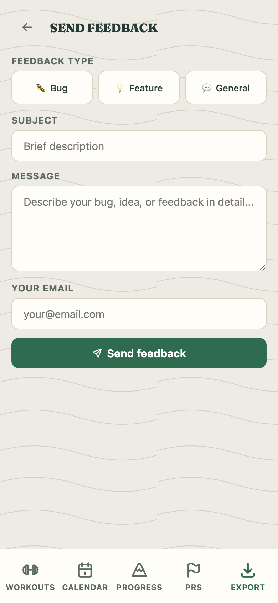

- Built-in feedback form for bug reports, feature requests, and general feedback

---

## How to use

1. Open the app at [jedmangubat.github.io/gainpath](https://jedmangubat.github.io/gainpath)
2. Complete the one-time setup (takes about 2 minutes)
3. Pick your training day and start logging sets
4. Rate how each exercise felt — it's saved with your session, and next time defaults to the weight you last logged
5. On iPhone: tap Share → **Add to Home Screen** for a native app experience

---

## What each day hits

Exercises are no longer fixed per day — every list below is just the
**starting default**. Open any day from the home screen to reorder, swap,
add, or delete exercises before you start (see "Full control over each day's
exercises" above); your changes become the new default for that day going
forward. What *doesn't* change is which muscle groups a given day is built
around:

### PPL / Upper-Lower
| Day | Muscles hit |
|---|---|
| Push | Chest, Shoulders, Triceps |
| Pull | Back, Rear delts, Biceps (Traps too, on the female default pool) |
| Legs | Quads, Hamstrings, Adductors, Calves, Core |
| Upper | Chest, Back, Shoulders, Rear delts, Biceps, Triceps |
| Lower | Quads, Hamstrings, Abductors, Core |

### 5-Day Bro Split
| Day | Muscles hit |
|---|---|
| Legs | Quads, Hamstrings, Calves, Core |
| Chest | Chest |
| Back | Back |
| Shoulders | Shoulders, Rear delts |
| Arms | Biceps, Triceps |

### Alternating Legs/Push/Pull
| Rotation | Muscles hit |
|---|---|
| Day 1 — Legs A | Same as PPL Legs day |
| Day 2 — Push | Same as PPL Push day |
| Day 3 — Legs B | Same as PPL Lower day |
| Day 4 — Pull | Same as PPL Pull day |

### Upper / Lower
| Day | Muscles hit |
|---|---|
| Upper | Chest, Back, Shoulders, Rear delts, Biceps, Triceps |
| Lower A | Same as PPL Legs day |
| Lower B | Same as PPL Lower day |

### Full Body
Chest, Back, Shoulders, Biceps, Triceps, Quads, Hamstrings, Calves, Core — one exercise per group, every session.

Male and female onboarding pick from slightly different default exercises for
the same muscle groups (e.g. machine vs. dumbbell variants) — swap freely
either way, the substitution pool isn't gendered.

---

## Add to iPhone home screen

1. Open [jedmangubat.github.io/gainpath](https://jedmangubat.github.io/gainpath) in Safari
2. Tap the **Share** button (box with arrow)
3. Tap **Add to Home Screen**
4. Tap **Add**

The app will appear on your home screen and open full-screen like a native app. Your workout data is saved in Safari's local storage.

> **Tip:** Export a backup regularly from the Export tab to protect your data.

---

## Tech stack

- Single HTML file — no framework, no build step, no backend
- Charts via [Chart.js](https://chartjs.org)
- PDF export via [jsPDF](https://parall.ax/products/jspdf)
- Feedback via [EmailJS](https://emailjs.com)
- Data stored in browser localStorage

---

## Contributing

Found a bug or have a feature idea? Use the feedback form inside the app (Settings → Send feedback) or open an issue on this repo.

---

## License

MIT — free to use, modify, and share.
