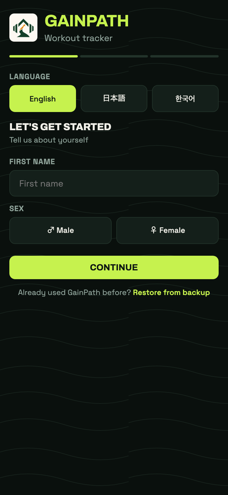
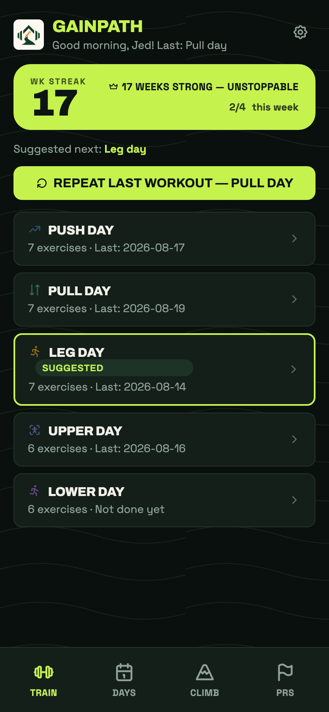
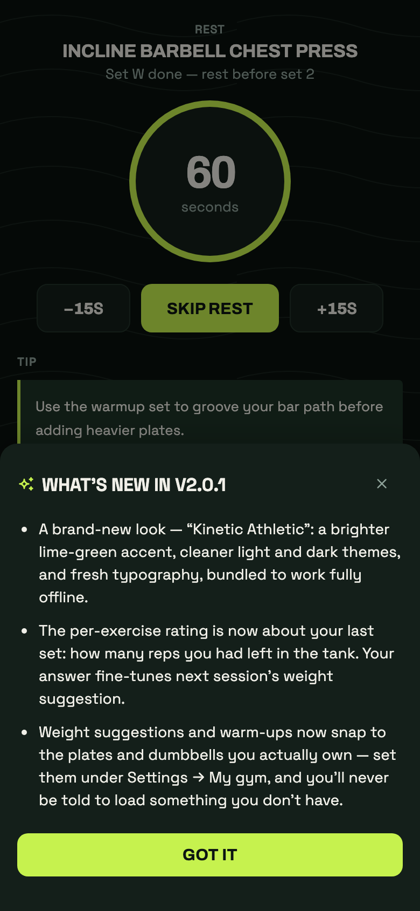
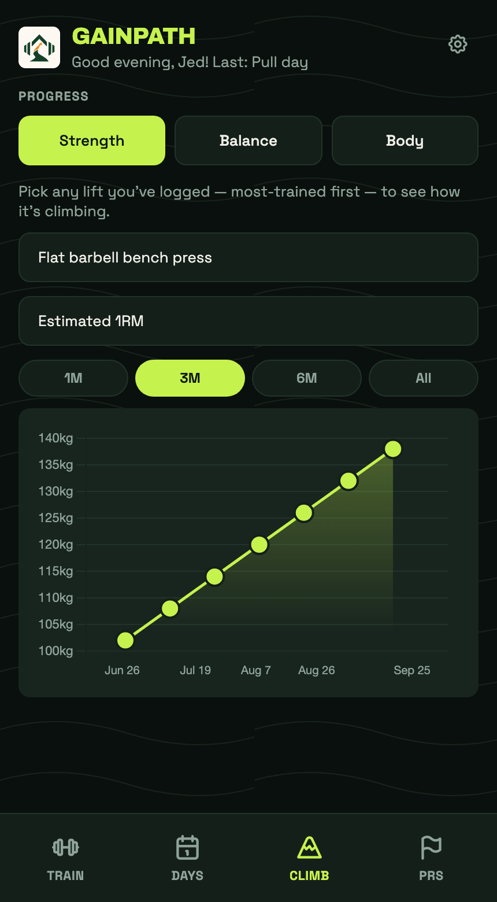

# GainPath — Workout Tracker

**A free workout tracker that suggests your next weight and keeps every workout on your phone.** No account, no ads, no subscription.

🔗 **[Open the app](https://jedmangubat.github.io/gainpath)** · [Lifting guides](https://jedmangubat.github.io/gainpath/guides/) · [Privacy](https://jedmangubat.github.io/gainpath/privacy.html) · [Changelog](CHANGELOG.md)

If it's been useful to you, consider [☕ supporting development via PayPal](https://www.paypal.com/donate/?business=jed.mangubat@me.com).

   

---

## ✨ What's new in v2.9.0

- **Faster setup.** Three short screens: your name, your body weight and experience, and your split. Everything else has a sensible default and lives in Settings.
- **Harder to lose your data.** A failed save now shows an alert with a one-tap backup. iPhone Safari users see a warning about the 7-day data wipe and how to avoid it.
- **Backups you control.** Save to Files or iCloud Drive from the share sheet, choose how often to be reminded, and undo a restore.
- **See what's shared.** Settings → Privacy lists exactly what leaves your device. Your workouts never do.

## Features

**Training**
- Five built-in splits: PPL / Upper-Lower, Bro Split, Alternating Legs/Push/Pull, Upper / Lower, Full Body. You can also build your own program.
- Edit any day before or during a workout: reorder, swap, add or delete exercises, and link supersets and circuits.
- A 221-exercise library, each with an illustrated guide, form cues and step-by-step instructions.
- Custom exercises for anything not in the library.

**Weights**
- Starting weights are estimated from your related lifts or, before you've logged any, from your body weight, sex and experience.
- After each exercise you rate how many reps you had left, and the app suggests your next weight. It's always a tap to apply or dismiss, never an automatic change.
- It suggests easing back after a break and offers a deload when you stall.
- Every proposed weight snaps to the plates and dumbbells your gym has (Settings → My gym).
- Plate calculator, machine base weights, warm-up sets, and straight or pyramid sets.
- Switch between kg and lbs anytime. Switching back restores your exact numbers.

**During a workout**
- One-tap set logging, with steppers to adjust the weight.
- Rest timer with sound, vibration, form tips and a preview of the next set.
- Hold timers for planks and carries, drop sets, notes that remind you next time, and a keep-screen-awake option.

**Progress**
- Charts of estimated 1RM, top weight and volume, plus muscle-group balance and body weight.
- Automatic PRs with their full history, and 16 achievement badges.
- A workout calendar that lets you edit or delete past sessions.
- A weekly streak that pauses for planned rest.
- A monthly PDF report and a shareable session card.

**Your data**
- Everything is stored on your device, with a second verified copy in IndexedDB.
- JSON and CSV export, restore on any device, and backup reminders.
- English, 日本語 and 한국어.
- Optional Apple Watch workout start and end through Shortcuts (may not work on iOS 27).

## Getting started

1. Open [jedmangubat.github.io/gainpath](https://jedmangubat.github.io/gainpath).
2. Answer three quick setup screens.
3. Pick a day, log your sets, and finish.

**On iPhone, add it to your Home Screen:** in Safari tap Share → **Add to Home Screen** → **Add**. Safari deletes a website's data after 7 days without a visit, but an installed app is exempt. Your existing workouts carry over.

## Tech

One `index.html` with no framework, no build step and no backend. It uses [Chart.js](https://chartjs.org), [jsPDF](https://parall.ax/products/jspdf), [EmailJS](https://emailjs.com) for feedback, and self-hosted [Tabler Icons](https://tabler.io/icons).

## Contributing

Found a bug or have an idea? Use Settings → Send feedback in the app, or open an issue.

## License

MIT
